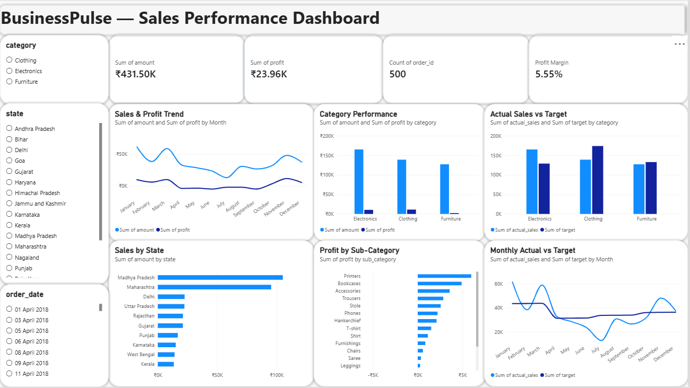

# BusinessPulse — Sales Performance Analytics

BusinessPulse is an end-to-end sales analytics project built to analyze e-commerce sales, profitability, customer behavior, product performance, regional trends, and sales targets.

The project demonstrates a complete analytics workflow from raw multi-table data to business insights through Python, PostgreSQL, SQL, and Power BI.



## Project Overview

The project uses sales order data and sales target data to answer key business questions such as:

- How much revenue and profit are being generated?
- Which categories and sub-categories perform best?
- Which products or regions are loss-making?
- Which states and cities contribute the most sales?
- How does profitability change over time?
- How do actual sales compare with targets?

## Tech Stack

- **Python**
- **Pandas**
- **PostgreSQL**
- **SQL**
- **Power BI**
- **Git & GitHub**

## Dataset

The project uses an e-commerce dataset described by Kaggle as sales details from an Indian e-commerce website.

The dataset contains:

- Order information
- Customer information
- Geographic information
- Product/category information
- Sales amount
- Profit
- Quantity
- Monthly sales targets

## Project Workflow

```text
Raw CSV Files
      ↓
Python + Pandas
      ↓
Data Cleaning & Transformation
      ↓
Multi-table Data Integration
      ↓
PostgreSQL
      ↓
SQL Analysis
      ↓
Power BI Dashboard
      ↓
Business Insights
